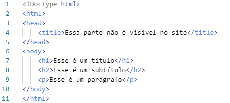
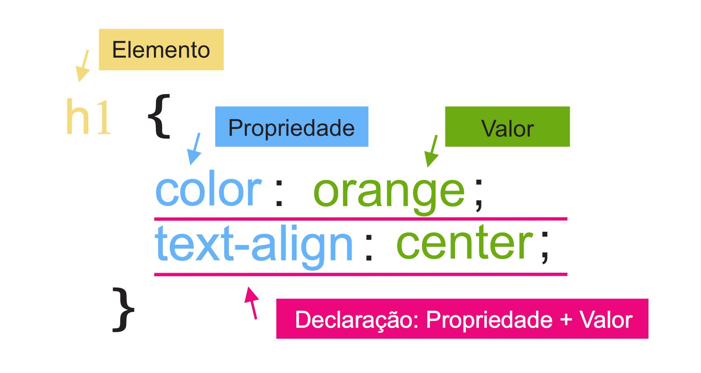

## HTML & CSS

Ao realizar a tarefa de criar um site a primeira etapa a ser feita é adicionar o texto que queremos visualizar no site e depois melhorar o aspecto tanto do texto quanto de todo o restante do ambiente que será mostrado ao usuário. Para executar essas tarefas são utilizadas as linguagens de formatação e estilo que são descritas respectivamente a seguir. 

## HTML

HTML é uma abreviação de Linguagem de Marcação de HiperTexto (do inglês *Hypertext Markup Language*). **O HTML não chega a ser considerado uma linguagem de programação**, mas é extremamente importante para colocar textos e organiza-los em uma página web. Para fazer essa organização do texto são utilizadas as Tags, que são etiquetas já pré definidas que determinam as partes do texto. Deste modo, é possível deixar claro qual parte do texto é o título, o(s) subtítulo(s), parágrafos simples, dentre outros (observe a figura abaixo). E se eu quiser deixar o meu título azul, mover ele um pouquinho para direita ou deixar o fundo amarelo? Isso já é um trabalho para o CSS! 

## CSS 

CSS é a forma abreviada de Folha de Estilo em Cascatas (em inglês *Cascading Style Sheets*). Assim como o HTML **o CSS também não é considerado uma linguagem de programação**. Pode até assustar no início, mas a função do CSS é deixar os textos que foram colocados e organizados no CSS em uma formatação muito mais bonita do que a formatação que já vem padronizada no HTML. Além do texto o CSS também pode alterar a formatação de todo o ambiente do site, deixando tudo de maneira mais atrativa para os usuários. A forma se comunicar com a CSS (escrever os códigos de maneira que ele entenda) é bem diferente do utilizado pelo HTML, como é mostrado na figura abaixo. Entretanto os dois precisam ser "conectados" para que o CSS saiba onde deve fazer as mudanças, esta conexão é feita através da tag <link> e no CSS os arquivos HTML são referidos pelo nome de sua tag, pela sua classe ou pelo ID. 

